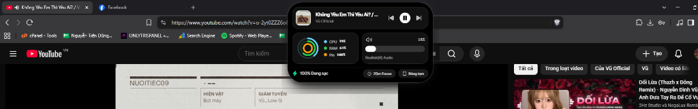
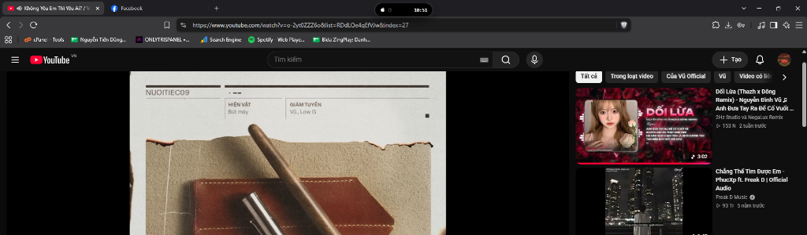
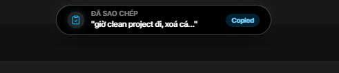

<div align="center">

# Windows Dynamic Island

### *The fluid, tactile Dynamic Island and Control Center for Windows 10 & 11.*

[](https://microsoft.com/windows)
[](https://v2.tauri.app/)
[](https://www.rust-lang.org/)
[](https://react.dev/)
[](https://framer.com/motion)
[](LICENSE)

[**Features**](#key-features) • [**Showcase**](#visual-showcase) • [**Architecture**](#architecture) • [**Quick Start**](#quick-start) • [**Gestures and Shortcuts**](#gestures-and-shortcuts) • [**Contributing**](#contributing)

</div>

---

<div align="center">
  
</div>

---

## Visual Showcase

<div align="center">
  <table>
    <tr>
      <td align="center" width="50%"><b>Expanded Control Center HUD (Music, Rings, Slider)</b></td>
      <td align="center" width="50%"><b>Compact Media Pill Floating on Desktop</b></td>
    </tr>
    <tr>
      <td align="center"></td>
      <td align="center"></td>
    </tr>
    <tr>
      <td colspan="2" align="center"><b>Global Hardware HUDs (Instant Clipboard Notification)</b></td>
    </tr>
    <tr>
      <td colspan="2" align="center"></td>
    </tr>
  </table>
</div>

---

## Overview

**Windows Dynamic Island** brings the modern Dynamic Island, iOS Control Center, and macOS HUD experience to Windows with zero compromise.

Engineered with a **Tauri 2 (Rust) Win32 native core** and a **React 19 / Framer Motion 13 frontend**, it provides 120 FPS spring physics, real-time System Media Transport Controls (SMTC) heuristic session scoring, WASAPI audio monitoring, hardware hotkey HUDs, and full integration with genuine Windows APIs.

> [!NOTE]
> **Zero Decorative Stubs**: Every single button, slider, and indicator executes genuine system actions: clicking CPU/RAM metrics launches Windows Task Manager, dragging the capsule slider adjusts master Windows volume, and dropping files stages them for instant reveal in File Explorer.

---

## Key Features

### Smart Multi-Session Media Engine
- **Heuristic Session Scoring**: Automatically prioritizes the media session actively playing across Spotify, YouTube, Apple Music, SoundCloud, Chrome, Brave, and Edge.
- **Anti-Stub and Multi-Tab Disambiguation**: Intelligently ignores paused social media stubs (Facebook, Twitter/X feeds) when an active music track is playing.
- **WASAPI Audio Verification**: Detects live audio rendering directly from Windows audio endpoints to verify true playback status.
- **Non-blocking Asynchronous Thumbnails**: Fetches high-resolution album artwork in a detached WinRT background thread with in-memory caching to eliminate UI thread stalls.
- **Waveform Visualizer**: Animated equalizer that reacts dynamically to playing and paused states.

### Control Center Full HUD
- **Zero-Clip Instant Expand**: Native Win32 window pre-sizing (`SWP_ASYNCWINDOWPOS | SWP_NOZORDER`) expands the window buffer at tick 0 before Framer Motion animations paint. No clipping, no black flash, no lag.
- **Concentric Activity Rings**: Concentric rings displaying live CPU load, RAM utilization, and battery state. Clicking the rings launches Windows Task Manager (`taskmgr.exe`).
- **Interactive Volume Capsule**: Smooth vertical slider with live mouse drag interaction and volume percentage display.
- **Focus Timer**: Configurable productivity timer with audio chime on completion.
- **Smart Clipboard Pill**: Displays the latest copied text snippet with one-click copy confirmation.

### Hardware HUD Overlays (Global Hooks)
- **Volume and Mute HUD**: Instant floating indicator when adjusting volume via keyboard media keys, accompanied by tactile audio feedback.
- **Caps Lock Indicator**: Real-time HUD displaying Caps Lock state changes.
- **Hysteresis Auto-Revert**: Displays HUD notifications for 1.3s-1.6s, then smoothly returns to the previous island state.

### Split Island (Dual-Bubble Physics)
- When a timer and music playback are active simultaneously, the island splits into two coordinated fluid squircle bubbles (Media on left, Timer countdown on right) with independent interaction targets.

### Real-Time Downloads Tracker
- Monitors the Windows Downloads directory. Automatically expands when a download begins, displaying live progress percentage and KB/s transfer speed, with a one-click reveal in Windows File Explorer when complete.

### Drop Shelf
- Drag and drop files from Windows Explorer directly onto the island to stage them for easy access, inspect file metadata, or open them in File Explorer.

---

## Architecture

```
+--------------------------------------------------------------+
|                    Windows Dynamic Island                    |
+------------------------------+-------------------------------+
                               |
            +------------------+------------------+
            |                                     |
            v                                     v
+------------------------------+    +--------------------------+
|      Rust Win32 Core         |    |  React 19 + Framer 13    |
|    (src-tauri/src/lib.rs)    |    |          (src/)          |
+------------------------------+    +--------------------------+
| - WinRT SMTC Media Manager   |    | - IslandContainer.tsx    |
| - Heuristic Session Scoring  |IPC |   (Squircle physics)     |
| - WASAPI Master Volume/Audio |<-->| - AppleControlCenterView |
| - Win32 Hooks (Volume/Caps)  |    | - SplitIslandView.tsx    |
| - Win32 SetWindowPos (0x4014)|    | - Hardware HUDs          |
| - Windows Downloads Watcher  |    | - Tailwind CSS v4 Glass  |
+------------------------------+    +--------------------------+
```

### Performance Benchmarks
| Metric | Value |
|:---|:---|
| **Idle Memory (RAM)** | ~30 - 38 MB |
| **Idle CPU Usage** | 0.0% - 0.1% |
| **Animation Framerate** | 120 FPS (Hardware Accelerated DirectComposition) |
| **SMTC Detection Latency** | < 15 ms |
| **Native Window Pre-Size Time** | < 1 ms (`SWP_ASYNCWINDOWPOS`) |

---

## Quick Start

### Option 1: Run Pre-Compiled Release
1. Download the latest release from Releases.
2. Extract the archive.
3. Double-click `run.bat` or `app.exe`.
4. The Dynamic Island will appear centered at the very top edge of your primary display.

### Option 2: Build from Source
Ensure you have [Node.js](https://nodejs.org/) (v18+) and [Rust](https://www.rust-lang.org/) installed on Windows.

```bash
# 1. Clone the repository
git clone https://github.com/onlytrisdev/dynamic-island-windows.git
cd dynamic-island-windows

# 2. Install dependencies
npm install

# 3. Launch development server with HMR
npm run tauri dev
```

To compile an optimized, standalone production release:
```bash
# Build frontend and compile native release binary
npm run build
npx tauri build --no-bundle
```
The compiled executable will be located at:
`src-tauri/target/release/app.exe`

---

## Gestures and Shortcuts

| Action | Gesture / Input | Description |
|:---|:---|:---|
| **Expand Full HUD** | **Hover** or **Left Click** | Expands into Control Center with media player, activity rings, volume slider, and tools. |
| **Collapse HUD** | **Mouse Leave** or **Click Outside** | Smoothly collapses back to the compact pill. |
| **Seek Music** | **Click Scrubber** | Seeks track position via WinRT SMTC. |
| **Volume Slider** | **Drag Vertical Capsule** | Adjusts Windows Master Volume in real-time. |
| **Task Manager** | **Click CPU / RAM Rings** | Spawns Windows Task Manager (`taskmgr.exe`). |
| **Sound Settings** | **Click Speaker / Device** | Opens Windows Sound Settings (`ms-settings:sound`). |
| **Context Menu** | **Right Click Island** | Opens settings, mode toggles, and exit options. |
| **Volume HUD** | **Hardware Volume Keys** | Displays the volume indicator overlay. |
| **Caps Lock HUD** | **Caps Lock Key** | Displays the Caps Lock state indicator pill. |

---

## Project Structure

```
windows-dynamic-island/
|-- src/                               # Frontend source (React 19 + TypeScript)
|   |-- components/
|   |   `-- DynamicIsland/
|   |       |-- IslandContainer.tsx    # Dynamic Island container & physics
|   |       `-- views/                 # Island state views
|   |           |-- AppleControlCenterView.tsx # Full HUD (Music + Rings + Slider)
|   |           |-- CompactMediaView.tsx       # Mini music pill view
|   |           |-- SplitIslandView.tsx        # Dual-bubble multitasking
|   |           |-- VolumeHudView.tsx          # Hardware volume overlay
|   |           |-- CapsLockHudView.tsx        # Caps Lock indicator
|   |           |-- TimerView.tsx              # Focus countdown timer
|   |           `-- DropShelfView.tsx          # Drag & drop staging shelf
|   |-- types/                         # TypeScript interface contracts
|   |-- utils/                         # Tauri IPC bridge & sound synthesis
|   |-- App.tsx                        # Master state machine & event listeners
|   `-- main.tsx                       # React application root
|-- src-tauri/                         # Native Windows backend (Rust)
|   |-- src/
|   |   `-- lib.rs                     # Win32, WinRT SMTC, WASAPI, Hooks
|   |-- Cargo.toml                     # Rust dependencies
|   `-- tauri.conf.json                # Tauri v2 window & app configuration
|-- public/                            # Static assets & icons
|-- run.bat                            # Quick launch script for Windows
|-- package.json                       # Node dependencies & metadata
`-- README.md                          # Documentation
```

---

## Tech Stack

- **Runtime Engine**: [Tauri v2](https://v2.tauri.app/)
- **Core Systems**: [Rust 2021](https://www.rust-lang.org/) with Windows Crate (`windows` 0.61)
- **Audio & Media**: Windows WinRT `SystemMediaTransportControls` & `WASAPI`
- **Window Management**: Direct Win32 APIs (`SetWindowPos`, `MonitorFromWindow`, `GetDpiForWindow`)
- **UI Framework**: [React 19](https://react.dev/) & [TypeScript](https://www.typescriptlang.org/)
- **Animation Physics**: [Framer Motion 13](https://framer.com/motion)
- **Styling**: [Tailwind CSS v4](https://tailwindcss.com/)
- **Icons**: [Lucide React](https://lucide.dev/)

---

## Contributing

Contributions are welcome. Please refer to [CONTRIBUTING.md](CONTRIBUTING.md) for detailed guidelines on how to submit bug reports, feature requests, and pull requests.

---

## License

This project is licensed under the MIT License - see the [LICENSE](LICENSE) file for details.
